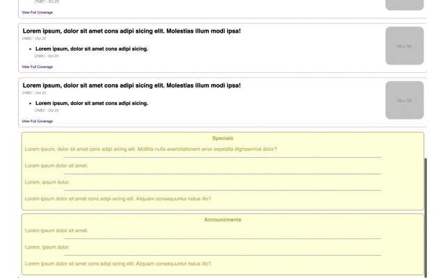
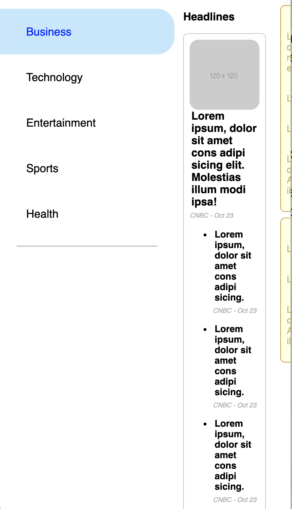

# CSS Grid Tutorial

In this tutorial, you'll apply CSS Grid Layout and *Responsive Design* to a news application.

## Starting Code

Look at the starting HTML code for the application in `index.html`. The HTML contains a left panel, main content area, and right panel. The stylesheet in `styles.css` includes styles for the general styling of the application. You'll work with both files in this tutorial.

If you run `index.html` using Live Server in VS Code, you'll see this:



Notice that the left panel is at the top, the main content is below that, and the right panel (yellow background) is below that. You'll rearrange this layout.

## Step One: Apply a grid to the page layout

In this step, you'll lay out the three areas—the left panel, main content, and right panel—of the document along the lines of a grid.

### 1. Add grid layout styles

First, make the body a grid container. Apply a new CSS rule to the `body` that sets the `display` property to `grid`. The CSS looks like this now:

```css
body {
  margin: 0;
  padding: 0;
  display: grid;
}
```

As you can see, this style alone doesn't fix the layout. This is because you haven't defined the columns and rows. To do this, you'll need to add rules for `grid-template-columns`.

The design has a left panel, main content area, and a right panel. This means the layout has three columns. The left panel must be `300px` wide, and the right column must be `250px` wide.  The main content area must take up the remaining space. Use one *fractional unit* to achieve this goal. The CSS property value for one fractional unit is `1fr`.

To define the columns, add the `grid-template-columns` property to the `body`. You'll assign three values to the property:

1. The width of the left panel: `300px`
2. The width of the main content area: `1fr`
3. The width of the right panel: `250px`

The `body` styles now look like this:

```css
body {
  margin: 0;
  padding: 0;
  display: grid;
  grid-template-columns: 300px 1fr 250px;
}
```

Add some spacing between the grid items using the CSS `grid-gap` property and assign it a value of `15px`. The CSS now looks like this:

```css
body {
  margin: 0;
  padding: 0;
  display: grid;
  grid-template-columns: 300px 1fr 250px;
  grid-gap: 15px;
}
```
Now the layout is finished.

> What value do these changes provide? You're already well on your way to a responsive design. You'll see this in the next section.

## Step Two: Apply a responsive design to the page layout

With the application running in the browser, expand the browser window until it takes up the entire screen. Next, grab the right edge of the browser. Slowly drag the edge of the browser window to make it smaller and smaller. Notice that the text wraps according to the *Normal Flow* rules. When the window is as small as it can be, it looks like this:



The menu now takes up too much space in the viewport. The article titles appear to be "squished", and you can't see the right panel.

After completing this tutorial, the fullscreen final solution looks like the image above. On a smaller screen, the page looks like this:


Notice that the menu is now across the top with the main content below and the right panel below that (not shown).

### 1. Review layout goals

**For screen sizes <= 800px:**

1. The left menu is placed at the top of the screen and spread across the width of the screen rather than down the left side.
2. The main content area takes up the entire width of the screen with spacing from the edges of the screen.
3. The right panel falls below the main content and takes up the full width of the screen with spacing.

### 2. Add responsive styles

Add this special CSS declaration at the bottom of the `styles.css` file:

```css
@media screen and (max-width: 800px) {
}
```
This means "_apply the styles contained within to media type screen and with a maximum width of `800px`._"

From this point forward, all styles go into the media query block.

Within the media query, you'll take advantage of CSS cascading by overriding only those styles needed to achieve the layout goals. Don't duplicate any styles that are already set and don't need to be changed.  For example, the `body` element already has the `display` property set to `grid`.  There's no reason to state this again. The only thing to do here is change, or override, the grid layout.

The layout goals section states that three columns need to become three rows. To accomplish this, override the `body`'s `grid-template-column` property to be a single value of `100%`. The original `grid-template-column` had three values that represented the sizes of three columns.

Using a single setting here only provides a single column that's `100%`, or "the entire" screen width. Additionally, each item must be offset from the edges. You'll add a new property called `justify-items` to the `body` and set its value to `center`. Add this CSS to the media query:

```css
    body {
        grid-template-columns: 100%;
        justify-items: center;
```

The `@media` styles looks like this:

```css
@media screen and (max-width: 800px) {
    
}    
    body {
        grid-template-columns: 100%;
        justify-items: center;
    }

```

Make sure the browser window is less than `800px` wide. Now when you scroll down the page, you'll see the menu followed by the main content area, and then the right column content, all thanks to these two CSS styles.

Now fix the spacing around the menu items so they don't take up as much screen space on a mobile device. Set the `margin` to `5px auto` on the `#left-panel > nav > menu`. Then set the `padding` to `0 7px` on the `#left-panel > nav > menu > li`. Finally, set the `margin` to `0` on the `#left-panel > nav > menu > li > a`. Once you add this CSS to the Media Query, it looks like this:

```css
    #left-panel > nav > menu {
        margin: 5px auto;
    }

    #left-panel > nav > menu > li {
        padding: 0 7px;
    }

    #left-panel > nav > menu > li > a {
        margin: 0;
    }
```

Next, you'll fix the light blue background. Right now, it's rounded on one end but not the other. To fix this, set the `border-radius` property on both the `.active-left-menu` and `#left-panel > nav > menu > li:hover`. Add these styles below the others. The CSS looks like this:

```css
    .active-left-menu,
    #left-panel > nav > menu > li:hover
     {
        border-radius: 30px;
    }
```

Now you'll change the menu list from a vertically stacked list to a horizontal list. Add a `display` property to the `#left-panel > nav > menu > li` and set the value to `inline-block`. As you'll recall, this makes the elements `inline` so *normal flow* is in effect while at the same time allowing the elements to receive dimensions. The CSS now looks like this:

```css
    #left-panel > nav > menu > li {
        padding: 0 7px;
        display: inline-block;
    }
```

The solution is progressing nicely.

Notice the heading _Headlines_ isn't centered, and that there's too much space between the heading and the menu. This is an element within one of the _Grid Items_ and not a grid item itself. That means the `justify-items` that is applied to the grid doesn't apply.

To fix this, add a style, `text-align`, to the `main h3` element and set its value to `center`. To fix the spacing, set the `margin` to `0`. The CSS for this looks like:


```css
    main h3 {
        text-align: center;
        margin: 0;
    }
```

The final responsive portion of the file should look like this:

```css
@media screen and (max-width: 800px) {
    body {
        grid-template-columns: 100%;
        justify-items: center;
    }
    #left-panel > nav > menu {
        margin: 5px auto;
    }

    #left-panel > nav > menu > li {
        display: inline-block;
        padding: 0 7px;
    }

    #left-panel > nav > menu > li > a {
        margin: 0;
    }

    .active-left-menu,
    #left-panel > nav > menu > li:hover {
        border-radius: 30px;
    }

    main h3 {
        text-align: center;
        margin: 0;
    }

}
```
If you've done everything correctly, the page looks like this:


When you resize the window, you may find that setting the _breakpoint_ to `800px` allows the main content to "squish" up and become unsightly. Experiment with different _breakpoints_ to discover a better solution. Share what you find with the class.

Additionally, you may find that a single breakpoint is rarely adequate to support the variety of screen sizes applications appear within. You might consider adding other media queries with different breakpoint sizes and styles that improve the view for those screen sizes.

## Summary

In this tutorial, you learned how to transform a non-responsive application into one that accommodates different screen sizes and use a CSS Grid and CSS Media Queries to establish breakpoints. The result represents a news article listing that can be viewed on multiple devices.

